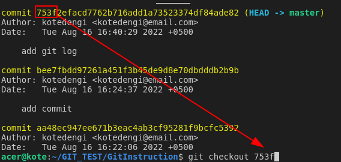

#  Краткая инструкция по работе с git  
  
***
*[Узнать подробнее про систему git на Wikipedia ](https://ru.wikipedia.org/wiki/Git)*
***
**Установить имя и email, которое будет использоваться  
при создании коммита:**

>*git config --global user.name "имя"*  
*git config --global user.email "email"*

**Вывести справку:**

>*git help*

**Узнать версию:**
>*git --version*

**Инициализация/создание репозитория:**
>*git init*

**Посмотреть сосотояние проекта, информация о файлах, изменениях,  
фиксациях и т.д.**
>*git status*

**добавить файл для отслеживания изменений:**
>*git add имя файла*

**добавить все файлы:**
>*git add .*

или

>*git add --all* 

**Создать commit (сохранить текущий статус с комметарием)**
>*git commit -m "комментарий"*

**Объединить add и commit**
>*git commit -am "комментарий"*

**Посмотреть журнал изменения (список коммитов)**
>*git log*

**Посмотреть журнал в другом отображении  
(reflog - сокращение от reference logs)**
>*git reflog*

**Посмотреть дерево журнала изменения (список коммитов)**
>*git log --graph*

**Переключение (переход) между версиями**
>*git checkout первые четыре символа имени commit  
(можно имя полностью)*

**Вернутся к самой последней версии изменений**
>*git checkout master*

**Посмотреть разницу между текущим файлом и сохранённым**
>*git diff*

**Просмотр текущей ветки и вывод всех веток**
>*git branch*

**Создание новой ветки**
>*git branch имя_ветки*

**Переход на нужную ветку**
>*git checkout имя_ветки*

**Слияние веток**
>*git merge имя ветки*

Порядок действий:

* переходим в ветку "master"
    >*git checkout master*
* добавляем в "master" "новую ветку"
    >*git merge имя ветки

*При слиянии может быть конфлик, когда в двух ветках есть что то перед слиянием.

**Удалить ветку**
>*git branch -d имя ветки*

